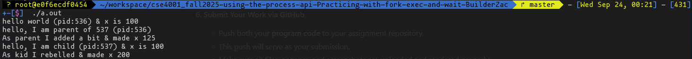
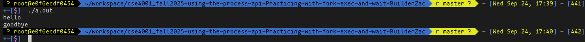
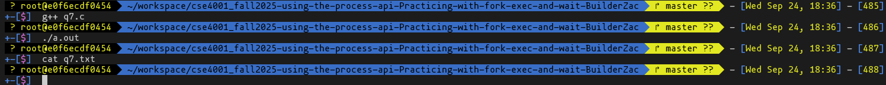

# Assignment: Practicing the Process API
Practicing with fork, exec, wait. 

### Overview

In this assignment, you will practice using the Process API to create processes and run programs under Linux. The goal is to gain hands-on experience with system calls related to process management. Specifically, you will practice using the unix process API functions 'fork()', 'exec()', 'wait()', and 'exit()'. 

⚠️ Note: This is not an OS/161 assignment. You will complete it directly on Linux. 

Use the Linux in your CSE4001 container. If you are using macOS, you may use the Terminal (you may need to install development tools with C/C++ compilers). 

**Reference Reading**: Arpaci-Dusseau, *Operating Systems: Three Easy Pieces*, Chapter 5 (Process API Basics)
 👉 [Chapter 5 PDF](http://pages.cs.wisc.edu/~remzi/OSTEP/cpu-api.pdf)

---

### **Steps to Complete the Assignment**

1. **Accept the GitHub Classroom Invitation**
    [GitHub Link](https://classroom.github.com/a/FZh4BrQG)
2. **Set up your Repository**
   - Clone the assignment repository.
3. **Study the Reference Materials**
   - Read **Chapter 5**.
   - Download and explore the sample programs from the textbook repository:
      [OSTEP CPU API Code](https://github.com/remzi-arpacidusseau/ostep-code/tree/master/cpu-api).
4. **Write Your Programs**
   - Adapt the provided example code to answer the assignment questions.
   - Each program should be clear, well-commented, and compile/run correctly.
   - Add your solution source code to the repository.

5. **Prepare Your Report**
   - Answer the questions in the README.md file. You must edit the README.md file and not create another file with the answers. 
   - For each question:
     - Include your **code**.
     - Provide your **answer/explanation**.
6. **Submit Your Work via GitHub**
   - Push both your **program code** to your assignment repository.
   - This push will serve as your submission.
   - Make sure all files, answers, and screenshots are uploaded and rendered properly.


---
### Questions
1. Write a program that calls `fork()`. Before calling `fork()`, have the main process access a variable (e.g., x) and set its value to something (e.g., 100). What value is the variable in the child process? What happens to the variable when both the child and parent change the value of x?


```cpp
// This code makes X & shows both parent & child now have an X but can write to it separately post fork.

#include <stdio.h>
#include <stdlib.h>
#include <unistd.h>

int main(int argc, char *argv[]) {
    int x = 100;
    printf("hello world (pid:%d) & x is %d\n", (int) getpid(), x);
    int rc = fork();
    if (rc < 0) {
        // fork failed; exit
        fprintf(stderr, "fork failed\n");
        exit(1);
    } else if (rc == 0) {
        // child (new process)
        printf("hello, I am child (pid:%d) & x is %d \n", (int) getpid(), x);
	x += 100;
	printf("As kid I rebelled & made x %d\n", x);
    } else {
        // parent goes down this path (original process)
        printf("hello, I am parent of %d (pid:%d)\n",
	       rc, (int) getpid());
	x += 25;
	printf("As parent I added a bit & made x %d\n", x);
    }
    return 0;
}
```


2. Write a program that opens a file (with the `open()` system call) and then calls `fork()` to create a new process. Can both the child and parent access the file descriptor returned by `open()`? What happens when they are writing to the file concurrently, i.e., at the same time?

```cpp
// Both processes can access the file & write to it at the same time. What gets written is determined by which process makes the api call first for each access. If example the parent made 1 call then had a timer the kid could write before the parent then the parent could write again.

#include <fcntl.h>
#include <stdio.h>
#include <unistd.h>

int main() {
    int fd = open("q2.txt", O_CREAT | O_TRUNC | O_WRONLY, 0644);
    int rc = fork();
    if (rc == 0) {
        for (int i = 0; i < 5; i++) dprintf(fd, "Child %d\n", i);
        _exit(0);
    } else {
        for (int i = 0; i < 5; i++) dprintf(fd, "Parent %d\n", i);
    }
    return 0;
}
```

3. Write another program using `fork()`.The child process should print “hello”; the parent process should print “goodbye”. You should try to ensure that the child process always prints first; can you do this without calling `wait()` in the parent?

```cpp
// In this code I use pipe to pass a variagle for when to print goodbye.

#include <stdio.h>
#include <unistd.h>

int main() {
    int p[2];
    pipe(p);
    int rc = fork();
    if (rc == 0) {
        close(p[0]);
        printf("Hello\n");
        write(p[1], "x", 1);
        _exit(0);
    } else {
        close(p[1]);
        char c;
        read(p[0], &c, 1);
        printf("Goodbye\n");
    }
    return 0;
}
```


4. Write a program that calls `fork()` and then calls some form of `exec()` to run the program `/bin/ls`. See if you can try all of the variants of `exec()`, including (on Linux) `execl()`, `execle()`, `execlp()`, `execv()`, `execvp()`, and `execvpe()`. Why do you think there are so many variants of the same basic call?

```cpp
// There are so many diffrent varients as they pass diffrent data to what is being launched.

#include <unistd.h>
int main() {
    if (fork() == 0) execl("/bin/ls", "ls", "-l", (char*)0); 
    return 0; 
}
```

5. Now write a program that uses `wait()` to wait for the child process to finish in the parent. What does `wait()` return? What happens if you use `wait()` in the child?

```cpp
// The parent gets back there exit code & the kid gets back -1.

#include <stdio.h>
#include <sys/wait.h>
#include <unistd.h>

int main() {
    int rc = fork();
    if (rc == 0) {
        int st;
	int w = wait(&st);
        printf("Child final words %d\n", w);
        _exit(25);
    } else {
        int st;
	int w = wait(&st);
        printf("Parent found body %d with code %d\n", w, WEXITSTATUS(st));
    }
    return 0;
}
```

6. Write a slight modification of the previous program, this time using `waitpid()` instead of `wait()`. When would `waitpid()` be useful?

```cpp
// In my example I just use waitpid() without really making use of it. It is useful if there are multiple kids & you want to select which one to wait on.

#include <stdio.h>
#include <sys/wait.h>
#include <unistd.h>

int main() {
    pid_t c = fork();
    if (c == 0) {
        int st; 
	int w = wait(&st);
        printf("Child final words %d\n", w);
        _exit(25);
    } else {
        int st; 
	int w = waitpid(c, &st, 0);
        printf("Parent found body %d with code %d\n", w, WEXITSTATUS(st));
    }
    return 0;
}
```

7. Write a program that creates a child process, and then in the child closes standard output (`STDOUT FILENO`). What happens if the child calls `printf()` to print some output after closing the descriptor?

```cpp
// Nothing it output in CMD or in the file.

#include <stdio.h>
#include <unistd.h>
#include <fcntl.h>

int main() {
    if (fork() == 0) {
        close(1);
        printf("test \n");
        open("q7.txt", O_CREAT | O_WRONLY | O_TRUNC, 0644);
        printf("testING\n");
        _exit(0);
    }
    return 0;
}
```

